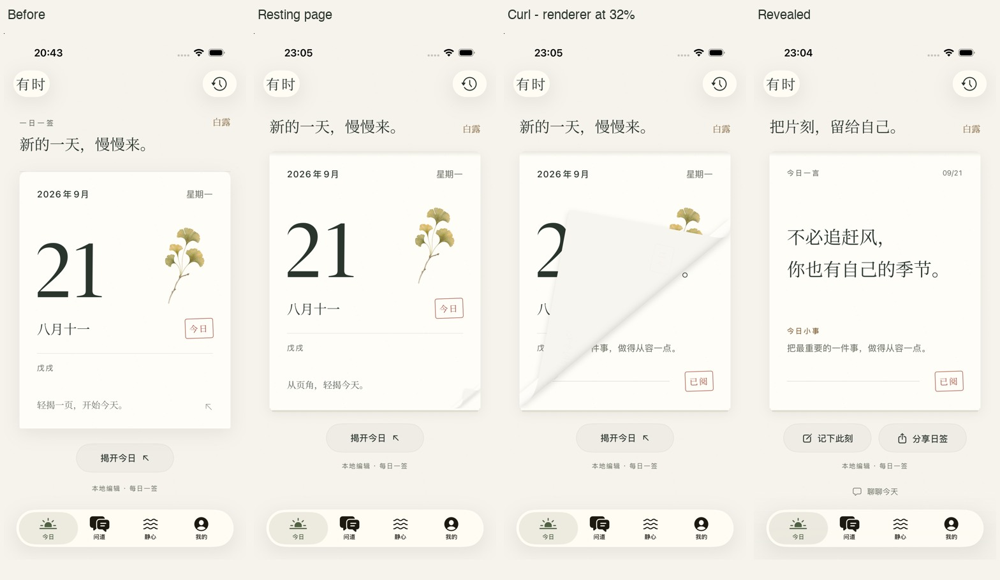

# 首页纸页揭开：设计迭代与验收

Method: dual-agent（A：`calendar_visual_critique`，网络失败后由 `calendar_visual_review_retry` 接续；B：`calendar_interaction_critique`）。各自独立评审，未互读报告。

日期：2026-09-21。分支：`codex/mingli-validation`。起点及当前 HEAD：`572d9e27d74309057b23249ff6b5faa4215389d1`。本次为该提交之上的工作区改动，没有创建新提交、推送、合并或发布，也没有把新包安装到用户手机。

## 结果

本轮完成纸页视觉与手势修复，并完成两轮独立 critique、一次最终独立确认。标准和较小 iPhone 模拟器的相关流程全部通过。保留奶油纸色、橄榄墨色、宋体、银杏与原有日签内容，不扩展命理、登录或后台范围。



第三格是 DEBUG 渲染器冻结于 0.32 的画面，只用于评估纸面，不能作为真实手势或动画时长证明。第四格来自最终 XCTest 实际揭开后的截图。所有画面来自原生 SwiftUI 模拟器，没有用网页重建。

## 独立评分与反馈闭环

评分是有证据支持的设计判断，不是客观性能指标。基线 A 与后续 A 是不同评审者，分数变化只作参考。

| 轮次 | 独立视觉评分 A | 独立交互评分 B | 主要发现与落实 |
| --- | --- | --- | --- |
| 基线 | 7.2 / 10 | 7.5 / 10 | 页角平、背纸被剪裁、拖动距离随纸高增加、辅助字号隐藏节气、揭开后焦点缺少衔接。 |
| 第一批改动后的评审 | 7.6 / 10 | 8.0 / 10 | 年月折行生硬、暗色折页不明显；B 找到拖出后回原点被误当轻点的确定缺陷。 |
| 最终确认 | **8.0 / 10** | **8.7 / 10** | 年月、页角和暗色层次改善；回原点决策修复有单测支持，相关 UI 流程通过。 |

主任务自评：**8.3 / 10**。优点是物理隐喻更一致、单手完成更轻松，且修复了实际错误路径。没有给更高分，因为极大字号的断句和留白仍有改善空间，暗色纸背中央仍稍显平直，真机触感及 VoiceOver 实际朗读没有实测。

最终独立原文：[视觉 A](reviews/calendar-2026-09-21-a.md)、[交互 B](reviews/calendar-2026-09-21-b.md)。完整早期记录在本地 `native/artifacts/calendar-design-2026-09-21/baseline/` 和 `round-1/`。

## 已落实的改动

| 问题 | 最终实现 | 验证依据 |
| --- | --- | --- |
| 静止页角与拖动时材料脱节 | 静止时的 31 pt 投影区与活动卷曲共用同一曲面；纸背有轻微透印，卷边有局部明暗。 | 最终静止图、0.12/0.32/0.58 冻结图及真实录屏抽帧。 |
| 卡片感与过重阴影 | 底层纸张移到封面裁切之外，露出薄纸边；顶部接触阴影锚定纸张，减轻外部浮影。 | 前后对比、深浅色实际画面。 |
| 曲面阴影叠加及采样 | 56 个采样集中在弯曲区，平直背面只用一条；先合成阴影轮廓再模糊，取消整片活动纸的外框裁切。 | 123 组尺寸/进度几何检查、冻结图与实际录屏。没有据此宣称 GPU 性能指标。 |
| 揭开距离随隐藏签文高度变长 | 完成距离改为宽度推导、限于 92–112 pt；与签文高度解耦。完成约 0.58 秒，返回约 0.32 秒。 | 多宽度正反例单测，两尺寸可达拖动 UI 测试。 |
| 页角轻点无效或短拉误触 | 单个 `DragGesture(minimumDistance: 0)` 统一轻点与拖动；80 × 80 pt 触区。超过 8 pt 后锁定方向，垂直滚动不取得揭页意图。 | 页角轻点、短拉取消、垂直移动、有效斜拉实际 UI 测试。 |
| 拉出后回到原点误揭开 | 记录手势全程最大位移；只有全程没有越过轻点容差的触摸才当作轻点。真正拖动按终点进度判定。 | 决策函数正反例：取得意图后回原点、拒绝方向后回原点、Reduce Motion、真正轻点、有效拖动。该精确多段轨迹没有真机 UI 自动化。 |
| 大字隐藏节气与年月碎裂 | 节气保留并可纵排；年月与星期自动转为上下排列；隐藏装饰印章与植物，保留事实内容及正常滚动。 | 两尺寸 AX XXXL 截图及滚动至实际页角的操作测试。 |
| 辅助访问衔接 | 页角有按钮语义和标准 action；已揭开后移除过期 action；焦点只绑定实际签文，并在其可访问后请求，测量副本不绑定焦点。 | 源码复核、可访问元素及后续流程通过；实际 VoiceOver 朗读未验证。 |

生产文件：`native/App/Features/Today/TodayView.swift`、新拆分的 `PaperCurlSurface.swift` 与 `PaperPeelInteraction.swift`。项目文件由既有 `native/scripts/generate-project.py` 生成，只增加新 Swift 源文件和测试引用。

## 测试结果

| 环境 | 范围 | 结果 |
| --- | --- | --- |
| iPhone 17 Pro，iOS 26.5，402 × 874 pt | 全部 42 项 `SujiTests` hosted tests（含 5 项新纸页测试） | **42 / 42 通过** |
| 同上 | 6 条受影响 UI 流程 | **6 / 6 通过** |
| iPhone 17e，iOS 26.5，390 × 844 pt | 复跑 3 条手势/大字 UI 流程 | **3 / 3 通过** |
| 工作区 | `git diff --check`；项目重新生成 | 通过 |

这是 42 项 hosted + 6 个独立 UI 用例，另有其中 3 个在较小设备上复跑，不把复跑算作新增用例。

6 条 UI 用例：

- `testPaperDragReturnsThenReveals`：短拉松手回原位，长拉揭开。
- `testPaperCornerTapAndReachableDrag`：页角轻点、−80/−88 pt 可达拖动。
- `testPaperLargeTypeScrollAndShortPullStayUnrevealed`：AX XXXL 保留节气，滚动找到实际页角，垂直移动和短拉不揭开，斜拉揭开。
- `testPaperReduceMotionAndRevisitPreserveRevealedDay`：减少动态效果、揭开后切 tab 及后台返回保持状态。
- `testRitualJournalHistoryAndShare`：揭开 → 写入日记 → 七日回望 → 分享预览 → 读取所写日记。
- `testDarkAndAccessibleRitual`：深色、极大字号、减少动态效果，以及静心/问道/资料相关原生流程。

较小设备复跑前 3 项。测试使用现有 `--ui-testing --notebook-fixtures` 的隔离内存资料，未读写用户实际账户。首页改动没有触及命理引擎/服务端；本轮未重复运行独立 Core 全量算法或后台部署回归。

### 中间失败没有隐藏

- 新的页角轻点测试在基线失败，证明原来的入口缺陷；保留 `baseline/red.log`。
- 首批改动的独立 tap/drag 识别器造成短拉误揭，已统一识别器，并在随后回归中通过。
- AX 手势测试曾因以整张可访问纸面的包围框计算坐标，实际落到错误区域而失败。改为定位真实 `ritual.corner`，保留原失败记录及后续通过记录。
- B 找到的回原点缺陷另行修复，没有把“测试坐标错误”解释扩展到真实逻辑缺陷。
- 早期 result bundle 因磁盘满损坏，移除了本任务损坏的生成物及可再生成的索引；保留失败日志。最终两个 xcresult 完整可读。
- `calendar_visual_critique` 后续执行确实返回 408。只重新发起未完成的 A，由独立替代评审完成；B 没有被无意义重复执行。最终两位都正常返回，没有持续网络阻塞。

## 证据与复现

原始本地证据目录（被 Git 忽略，避免提交构建产物）：

- `native/artifacts/calendar-design-2026-09-21/final/tests.xcresult`、`xcode.log`：42 hosted + 6 UI。
- `final/small-tests.xcresult`、`small-xcode.log`：较小设备 3 UI。
- `final/attachments/manifest.json` 和 `final/small-attachments/manifest.json`：XCTest 截图与用例的对应关系。
- `final/small-flow-raw.mp4`：本轮较小模拟器 52 秒原始流程录屏；`final/gesture-live.mp4` 是正常速度截取的短拉取消、再次拖动揭开片段。
- `final/motion-live-detail.jpg`：上述真实手势视频抽帧，已检查；不使用冻结渲染器图代替运动证据。
- `final/rest.png` 等冻结状态图：完整加载后捕获并肉眼核对农历、干支、节气。早期 `round-1/rest.png` 捕获过早，不作为最终比较依据。

仓库内便于长期查看的图：[对比](../../native/Documentation/calendar-2026-09-21/comparison.jpg)、[静止](../../native/Documentation/calendar-2026-09-21/rest.jpg)、[卷曲](../../native/Documentation/calendar-2026-09-21/curl-32.jpg)、[深色卷曲](../../native/Documentation/calendar-2026-09-21/dark-curl.jpg)。

复现标准设备回归（替换为本机可用 simulator ID；结果目录必须尚不存在）：

```sh
xcodebuild -project native/Suji.xcodeproj -scheme Suji -configuration Debug \
  -destination 'platform=iOS Simulator,id=09FF0B1D-9E60-4F2A-9465-3B156C88BD28' \
  -derivedDataPath native/DerivedData -parallel-testing-enabled NO \
  -collect-test-diagnostics never COMPILER_INDEX_STORE_ENABLE=NO \
  -only-testing:SujiTests \
  -only-testing:SujiUITests/SujiUITests/testPaperDragReturnsThenReveals \
  -only-testing:SujiUITests/SujiUITests/testPaperCornerTapAndReachableDrag \
  -only-testing:SujiUITests/SujiUITests/testPaperLargeTypeScrollAndShortPullStayUnrevealed \
  -only-testing:SujiUITests/SujiUITests/testPaperReduceMotionAndRevisitPreserveRevealedDay \
  -only-testing:SujiUITests/SujiUITests/testRitualJournalHistoryAndShare \
  -only-testing:SujiUITests/SujiUITests/testDarkAndAccessibleRitual \
  -resultBundlePath /tmp/suji-paper-verification.xcresult test
```

## 最终设计判断

本轮不是换一套品牌。日历的大日期、植物、农历和印章仍是识别核心；新增的纸边和曲面服务于“揭开一天”的动作，未增加装饰卡片或解释负担。主任务只有一次揭开决策，按钮提供直接替代路径。

以下是主任务基于两位评审综合后的启发式评分；与独立视觉/交互十分制分开记录。

| 启发式 | 分数 / 4 | 判断 |
| --- | --- | --- |
| 状态可见 | 3 | 拖动与门槛提示、揭开后内容清楚；实际朗读顺序未测。 |
| 符合现实隐喻 | 3 | 纸边、薄背面、卷曲成立；暗色中央仍偏平。 |
| 用户控制 | 3 | 短拉取消、回原点决策已修；非所有系统中断轨迹都已操作。 |
| 一致与标准 | 4 | 原生导航，页角/按钮/action 指向同一动作。 |
| 防止误操作 | 3 | 方向意图、阈值与全程位移分类；精确多段回原点仍为逻辑回归证据。 |
| 识别优于记忆 | 3 | 文字和按钮清晰，静止折角仍较含蓄。 |
| 灵活与效率 | 4 | 轻点、有限距离拖动、减少动态效果等入口。 |
| 审美与克制 | 3 | 识别度强、信息减少重复；极大字号节奏仍可细化。 |
| 错误恢复 | n/a | 本次本地日签操作没有独立的可编辑/网络错误恢复状态。 |
| 帮助与说明 | 3 | 简短就地提示充分，无需教程。 |
| **合计** | **29 / 36** | 本轮针对首页纸页，不代表整个 App。 |

首次使用者有文字按钮作为明确入口；单手用户的完成距离不再受长签文影响；低视力用户的节气被保留，且可正常滚动。屏幕阅读器用户仍需真实 VoiceOver 检查，不能用元素存在断言替代。

没有新增已确认的 P0/P1 阻断。保留精修观察：AX 问候和签文会在“慢 / 慢来”“季 / 节”处断行，年月与日期之间留白较长；暗色纸背中央偏平；浅色静止折角对比克制。它们不影响本轮已验证流程，也不通过缩小用户字号来掩盖。

## 明确未验证的事项

- 真机 VoiceOver 揭开后的实际播报与焦点顺序；本轮只完善实现与语义。
- 真机 60/120 Hz、GPU 开销和触觉质量。模拟器录制帧率不能当作 App 帧率。
- 一根手指完整“拉过门槛 → 回到原点”的多段 UI 轨迹，以及每个动画时刻的系统中断。前者有生产接线和决策单测，后者保留原中断收敛/token 保护；不要宣称所有瞬间都已测试。
- iPad、横屏及比本次两台更窄的设备未纳入本轮；本次是两种 iPhone 竖屏尺寸。
- 本次没有远端 CI、发布或真机安装记录，不能称作已上线。

Questions skipped: 用户已明确授权继续修复与收口；本轮没有需要新增产品决策的阻断项。
