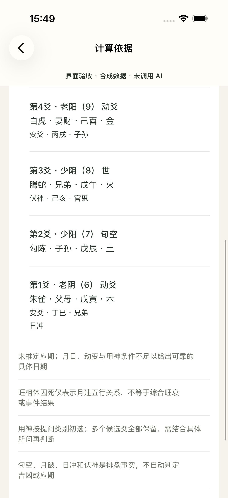
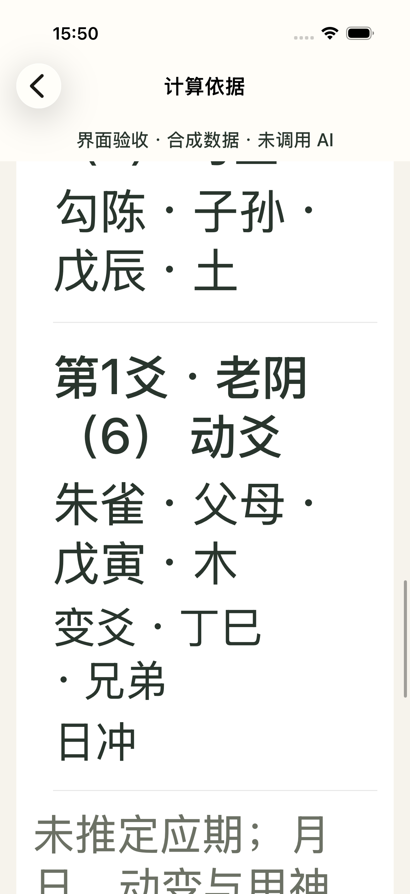
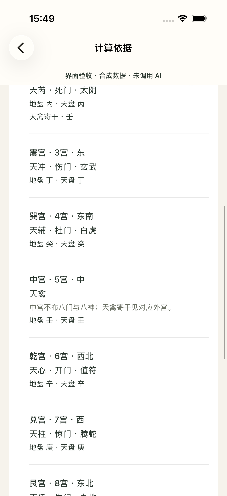
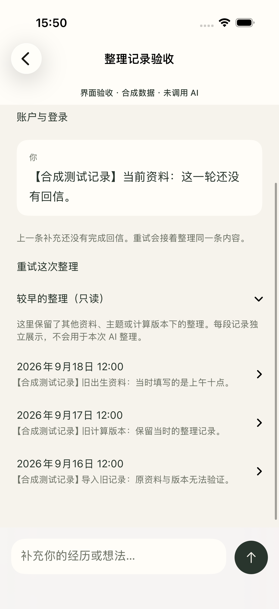
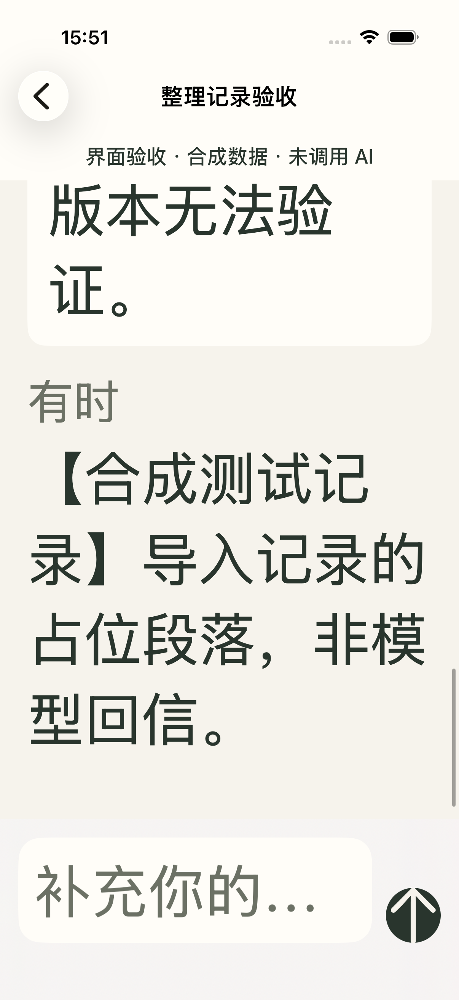
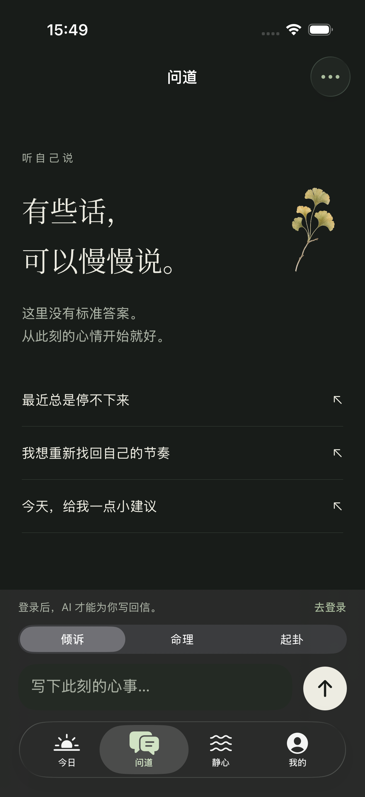

# 六爻、奇门与历史整理：界面及可访问性复验

日期：2026-09-19。沿用 `.impeccable.md` 的温暖、小众、治愈语境与宋体标题、系统正文、纸色墨色和原生导航。本次只处理依据明细、旧整理的辨认和输入提示，不扩展成重设计。

## 证据与范围

设备为 iPhone 17 Pro / iOS 26.5，中文，默认字号及 Accessibility XXXL。使用真实的 `ReadingEvidenceView`、`ReflectionView`、`ChatView`，而不是截图模型或另画的展示页面。

六爻固定输入自下而上 `[6,7,8,9,8,7]`，参考时刻 `2026-09-19T04:00:00Z`；本地引擎得到火水未济 → 山泽损。奇门使用同一时刻的合成问题。用于生成 UI 样本的引擎 bundle SHA 为 `451036e701144f190def6f733d70b0d7589b95d8586ef02d0d70365c8d3fe9b0`。样本生成脚本为 [generate-mingli-audit-fixture.mjs](../../../native/UITests/generate-mingli-audit-fixture.mjs)，已实际运行；这组记录用于界面验证，不能充当独立算法正确性证明。

整理记录使用合成出生资料 `1995-01-01 12:00，女，上海，121.47°`，分别准备当前待完成回合、不同出生时刻、较早引擎版本、无来源身份的导入记录。所有记录均带「合成测试记录」，占位助手段落明确写「非模型回信」。入口同时要求 `DEBUG`、`--ui-testing` 和 `--mingli-detail-fixtures`，使用内存册页，不恢复账户、不请求模型；Release 不编译 fixture 视图或数据。

20 张保留截图、对应的 20 份 XCTest 可访问树及两份输入框坐标见 [capture-manifest.json](../../../native/Documentation/mingli-details/capture-manifest.json)，全部来自最终通过的 UI 测试，且已逐张目视。明细与整理 fixture 图的固定横条明确标识「合成数据 · 未调用 AI」；问道图是正常匿名空状态。这不是登录后真实 AI 回答验收，也没有执行跨账户切换的网络竞态。

## 阅读与分组

六爻的每行按上爻至初爻排列，保留阴阳/数值、世应、动爻、旬空、六神、六亲、纳甲、五行、变爻和伏神等实际字段。默认字号下，短行与分隔线便于横向核对；XXXL 使用纵向换行，不缩小字号，也不横向裁掉干支。

奇门维持九宫列表，摘要先给局数、节气、符头、值符和值使，展开后显示各宫星、门、神与天地盘干。中宫没有八门、八神时补充明确说明；天禽寄干在对应外宫显示，避免空字段看起来像取数失败。

较早的整理保留在只读展开项中，每段独立显示。此前标题仅有日期，用户难以辨认同一天的多段记录；现在加入首条问题摘要，展开仍显示全文。日期和摘要形成一个可访问标签，不把其他出生资料或旧引擎记录混入当前回合。

测试逐一展开三个旧记录组，断言各自独有的占位文本，再折叠并断言该段正文不再出现在可访问树；同时确认当前待完成回合仍有重试入口、匿名时不可发送。它验证的是旧记录展示和隔离呈现，模型历史过滤仍由 Core/服务层测试负责。

## 输入提示的实际对比度

原系统默认 placeholder 经过渲染后明显偏淡。本轮在问道和整理输入框显式使用现有 `SujiTheme.secondary`，同时提供独立可访问名称。

以下颜色来自原始 1206×2622 截图的文字笔画实心像素和相邻输入框背景，不是单看设计 token。取样区域为 `(90,2210)…(700,2310)`，与 XCTest 记录的输入框 `x=34, y=742, w=274, h=23` pt 对应；计算采用 sRGB 相对亮度公式。边缘抗锯齿混色不作为文字前景色。

可用 [measure-placeholder-contrast.py](../../../native/UITests/measure-placeholder-contrast.py) 重算；[机器记录](../../../native/Documentation/mingli-details/placeholder-contrast.json) 保留了每张来源 PNG 的 SHA256、采样像素数和计算值。

| 状态 | 实际文字 | 实际背景 | 对比度 |
| --- | --- | --- | --- |
| 修前浅色 | `#C5C3C2` | `#FFFDF8` | 1.727:1 |
| 修后浅色 | `#6C7165` | `#FFFDF8` | 4.933:1 |
| 修前暗色 | `#5F6462` | `#242A24` | 2.435:1 |
| 修后暗色 | `#ADB4A7` | `#242A24` | 6.889:1 |

修前图来自 `mingli-improvements/10-chat-start.png` 与 `24-dark-chat.png`；修后来自本目录清单中的 `60`、`61`。这两个静止状态的 placeholder 已达到普通文字 4.5:1 的参考标准；不据此宣称整款 app、系统材质、所有主题或所有交互状态都符合 WCAG。

## 可访问树检查与限制

XCTest 导出树中可找到全部 6 个爻行和 9 个宫位。每一行合并为一个带完整内容的 `StaticText` 可访问元素；序号、干支、变化等不是只有图形。原生展开控件保持按钮语义和展开/收起标记。旧记录按钮的标签同时包含日期和问题摘要；两个输入框名称分别为「写下此刻的心事」「补充你的经历或想法」。

XXXL 的实际截图验证了换行、纵向滚动以及末端记录可到达。记录摘要最多两行是有意的概览，正文仍可展开阅读；没有为维持一屏而压缩专业明细。

这是可访问树与触达检查，**未开启 VoiceOver 进行真实语音朗读、转子或手势巡游**。因此不声称已验证罕见字的发音、多音字、逐项焦点体验、Switch Control、外接键盘或所有小屏设备。长专业段落在最大字号下需要多次滚动，这一体验仍应由实际使用辅助功能的人手工验收。

## 测试记录

初轮发现测试标识从外层 DisclosureGroup 继承到子项，影响定位；已移除外层标识并按真实按钮类型定位。奇门中宫测试曾错误假定天盘干为空，已按 fixture 的实际 `壬` 值纠正。XXXL 旧记录曾因定位到展开内容而未触发组标题，已改为按钮标题坐标，并加强为逐组独有文本及折叠断言。这些早期失败不是最终通过记录。

最终 UI 结果为 `/tmp/suji-mingli-details-final.xcresult`：2026-09-19 15:51（UTC+08）完成，5 项 UI 测试全部通过，148.571 秒；同次构建的 13 项 hosted 应用测试也全部通过，总计 18/18，零失败、零跳过。包括 Keychain、账户隔离、Widget 数据、持久化迁移和异步资料更新。App 与 Widget 均为签名模拟器 Debug 构建，且 `codesign --verify --strict` 通过。

截图对应本轮 v6 校验器构建，App 版本为 `1.0.0 (1)`，Xcode build `17F113`，iOS SDK `26.5`。当时 Swift、引擎资源和项目文件的聚合 SHA256 为 `1707dc9199c130dc08a589b32ce8c74500df368e60e7ce379854eb6c08efdd33`；可复算规则、二进制 SHA 和测试摘要存于截图清单。源文件和实际 App 内 `mingli.js` 的 SHA 均与上面的 fixture 引擎相同。

随后 Core v7 调整了解释接受前的校验与时间比较，未修改这些界面或 fixture。包含最后一处真太阳时比较修复的增量构建在 15:54（UTC+08）完成：`/tmp/suji-mingli-v7-final-hosted.xcresult` 中 13/13 hosted 测试通过，1.190 秒；App/Widget 签名校验再次通过。最终源文件聚合 SHA 为 `5e4aff20b7405262f47d76461fae8c998f783b36955015b8c564b29c9b55b127`，构建前后保持一致。它与截图构建的二进制、摘要和 SHA 分别保存在清单的 `finalCoreValidation` 与 `build` 中；未重复 UI，也不把 v6 截图宣称为 v7 的真实模型回信验证。
