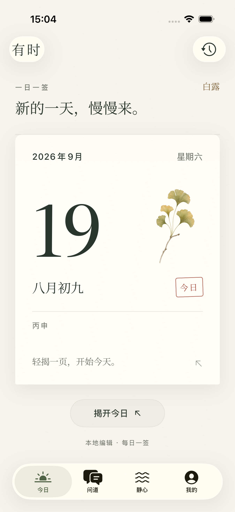
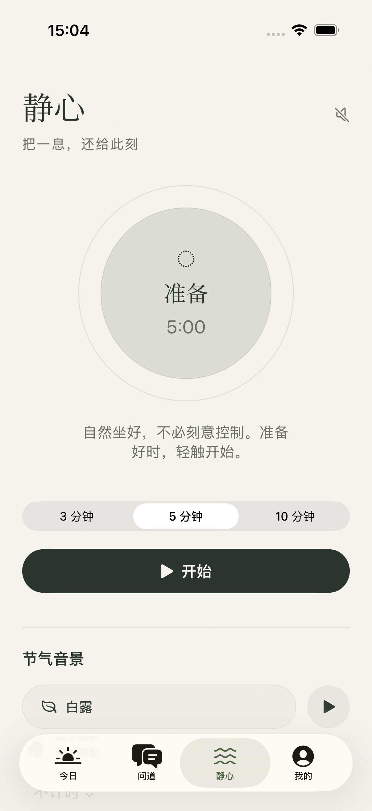
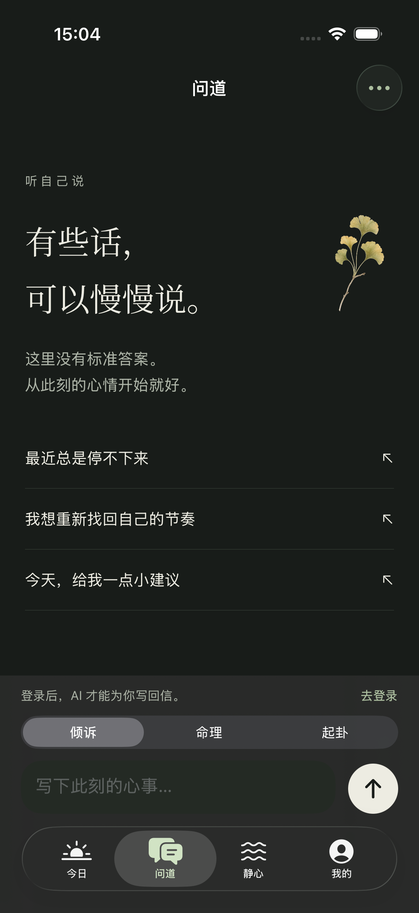
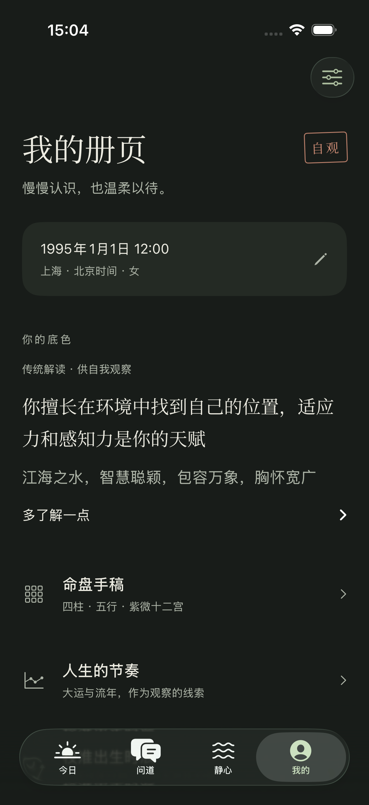
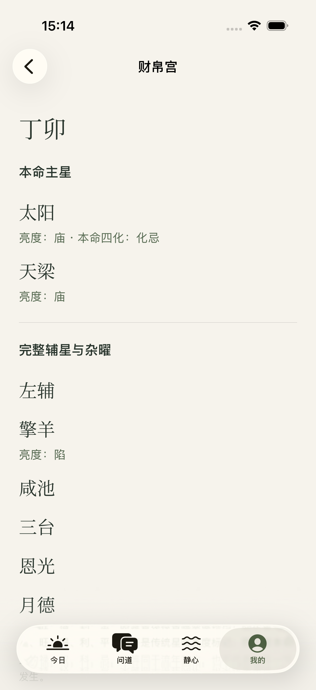
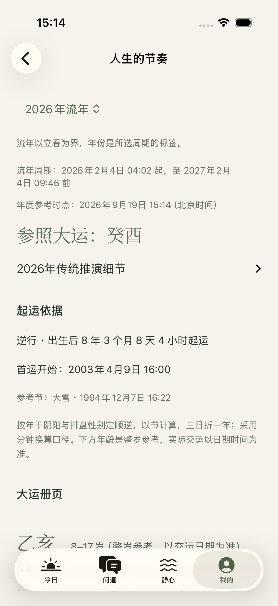

# Impeccable：有时的界面设计与专业阅读体验

审查日期：2026-09-19。本次检查覆盖基线、改进与修后实拍；这里不把设计检查等同于命理算法验证。

这套界面的辨识度已经成立：像一本可随手翻阅的纸册，宋体标题、橄榄墨色、少量朱砂印记和银杏细节彼此呼应。值得保留的是克制的视觉和原生操作。最需要改进的是专业内容的组织：让用户分清记录、计算事实、传统解释和文献候选，而不是让它们以相同语气出现在同一个层级。

## 设计语境与证据

采用仓库 `.impeccable.md` 中创作者确认的语境：25–40 岁、对传统文化好奇但不迷信的用户；早间日签、夜间静心、偶尔自我观察；品牌是「温暖、小众、治愈」。本次使用 Impeccable 的排版、空间、色彩、状态与反模板检查，并配合 Product Design 的实际截图审查。

保留已确认的 Noto Serif SC 标题与系统正文字体、纸色与墨色、原生 TabView / NavigationStack / Form。技能中的泛化字体禁用规则不覆盖用户已经选择的字体，也没有为了显得不同而替换整个视觉。

本轮独立运行使用 iPhone 17 Pro / iOS 26.5、中文、默认字号、暗色和 Accessibility XXXL。资料为 `1995-01-01 12:00，女，上海，东经 121.47°`，使用内存测试册页，没有私人资料或真实模型答案。

基线问题与结构检查见 [product-architecture-critique.md](product-architecture-critique.md)。四个 tab 先以 `/tmp/suji-impeccable-four-tabs.xcresult` 做中期视觉检查，随后重新构建、修复并复拍。文内展示修后实拍；对应构建、引擎文件摘要和测试结果见文末及截图 manifest，截图不能代替算法正确性的独立验证。

## 四个主要页面

### 今日：保留记忆点，让仪式聚焦

日历的大日期、纸页边缘和小块银杏是最有辨识度的组合。大数字在这里对应日历本身，有明确使用意义；不应机械套用技能对装饰性大指标的反对。标题和纸页之间的留白把「揭开今日」留作唯一主要动作，历史入口独立放右上角，层级清楚。

朱砂仅用于「今日」印记，没有把整个传统文化产品做成红金色。日期和植物不对称排布，避免了平铺卡片的模板感。暗色继续保留纸与墨的层次，而不是反转成纯黑霓虹。未在本轮重做此页；拖页动效、触感与 Reduce Motion 不在这组静态截图的证明范围内。

### 静心：主要动作清楚，来源信息可下沉

圆形呼吸焦点、时长选择、横向开始按钮形成顺序明确的任务路径。「准备」及 5:00 是状态信息，不是装饰。夜间墨绿背景与浅色开始按钮保持了明确焦点，符合睡前使用场景。

中期截图里的「合成音景 / 原创程序合成」将实现方式放在了主要界面上。现已改为「节气音景」，并在混音区末尾加入「关于这些声音」展开项，明确音景实时合成、并非自然录音。最后一个音量控件和来源说明都能完整滚到 tab 上方；本次未覆盖更小机型。

### 问道：安静、可信，但要提前说明当前状态

标题、植物、三条开放问题和底部输入区延续同一品牌；起始问题使用行分隔，没有为每个建议堆一张卡片。命理与起卦模式是功能切换，应随着模式展示相应的上下文和输入提示，避免用户以为所有提问都会使用同一类证据。

基线登录提示在发送后才出现。现在输入区预先显示登录说明和入口，访谈页也在开始前提示并禁用匿名生成。浅色与暗色输入框占位文本都明显比邻近文字淡，需要按实际合成色验证并适度提高可辨识性，不能只凭截图宣称 WCAG 失败。本轮没有用真实 AI 对话验证回答组织与引用展开。

### 我的：从温柔的首页到可复核的命盘

出生记录、性格简介和命盘入口有足够间隔。新增「传统解读 · 供自我观察」使性格文字有清楚身份；它仍然是阅读入口，不把未经验证的性格描述装成测量值。整个页面没有被切成一组同尺寸功能卡。

专业页面的问题原本不在缺少装饰，而在缺少分类和来源。本次在此范围实际实施了以下变化。

## 已实施的层级与内容设计

| 位置 | 基线问题 | 本轮实现及设计理由 |
| --- | --- | --- |
| 出生表单 | 经度只有数值；两个体系的时间口径不清 | 保留出生地和经度标签、单位、公历日期，固定 UTC+08；常用城市是快捷选择而不是唯一输入；说明太阳时作用范围 |
| 五行与取用 | 四项固定一行，大字拥挤 | 常规两列、辅助字号一列；数值与名称合成一个可访问元素，避免为装下而缩字 |
| 扶抑 / 格局 | 同一页面两种「用神」看似自相矛盾 | 分成「扶抑参考」与「格局用神」，展开后解释各自方法；保留真正的差异，不用文案掩盖算法口径 |
| 调候 | 自动结论与待核文献易混同 | 独立「调候文献候选（条件待核）」展开项；提供候选、原文、条件和来源状态，不使用确定结论的标题 |
| 紫微 | 主星为空时像数据缺失，辅星被截断 | 明写「无主星」，标身宫、亮度、本命四化；宫位进入详情，展示完整星曜 |
| 大运 / 流年 | 解释先于事实，没有可核对日期 | 年度时点和所在大运优先；起运依据与完整交运日期接续；长篇传统解释收进展开项 |
| 时辰参照 | 同年体系互相覆盖，候选只剩整点 | 完整日期、民用时间、双体系并列；候选差异按同年比较；采用前明确原值、候选值和分钟替换 |
| 关系 | 连续两个「无特别关系」没有字段名 | 双方日柱先出现，再分别列日干关系与日支关系；明确资料仅本次比较使用 |
| 访谈 | 失败后追加「请继续」，旧资料可能混入新轮次 | 重试复用待完成回合；旧历史折叠只读；账户、出生资料、依据或引擎版本变化后须重新打开整理 |

紫微采用可深入的两列宫位摘要而非强行挤成手机十二宫方盘，是此产品的有意取舍：普通用户先读名称与星曜，需要时进详情；辅助字号自动改一列。卡片在这里代表独立宫位，且内容长度由真实星曜决定，不是营销式同尺寸卡片网格。详情只用标题、留白和分隔线，不再套卡片。

流年选择明确以立春周期为单位；与当前时点所属流年不同时会提示区别。事实日期优先，推演文字收进展开项。异步结果绑定当前账户、完整出生资料、引擎版本和所选年份，失败清掉旧结果；校时采用也核对候选来源，避免页面看起来更新了但仍使用旧盘。

## 排版、颜色、空间与无障碍

- **排版**：宋体集中在页面名、宫位主星和关键干支；条件、来源、日期和操作仍用系统正文，长说明有行距。术语不靠增大字体冒充更确定的结论。
- **空间**：页面保持 24pt 边距；主要段落 24–28pt，事实组内 12–16pt，字段与补充说明更紧凑。通过分组和展开控制密度，不把每句话都放进色块。
- **颜色**：墨色为正文、橄榄为重点、次要文字用同色系。暗色补齐命盘、校时、关系页面的明确前景色。新增组件复用现有 token。
- **对比度**：按不透明 token 计算，浅色次要文字 `#6C7165` 对纸色 `#F6F3EC` 为 4.53:1，橄榄 `#596C54` 为 5.12:1；暗色次要文字 `#ADB4A7` 对 `#181C19` 为 8.09:1，橄榄 `#ABBD9E` 为 8.62:1；青瓷次要文字为 4.69:1。这只验证这些色对，不覆盖透明叠加、占位文字、系统材质或全部状态。
- **大字号**：四柱保持横向滚动以保留表格含义，五行改为一行一个键值、宫位改成单列。没有以缩小字号或截断文献条件换取整齐。
- **交互语义**：导航用原生 NavigationLink，展开用 DisclosureGroup，资料录入用 Form；候选采用保留二次确认和恢复入口。实际 VoiceOver 顺序、朗读冗余、Switch Control 和实体设备触感仍需手工验收。

## 尚需明确的产品边界

1. **未知出生时刻仍不被支持。** 页面说清限制不等于完成「未知/范围」数据模型；不能为了允许保存而悄悄填 12:00。应后续明确哪些结论可在未知时刻显示、哪些必须停用。
2. **全球时区与历史夏令时尚未验证。** 当前输入是固定 UTC+08 的民用记录，UI 的「北京时」说明不能替代真实时区转换。
3. **文献可读性还需要真实用户验证。** 条件越完整，阅读越长；本次以展开与层级处理，没有删掉会影响理解的前提。仍需观察普通读者是否能区分格局、扶抑、调候。
4. **AI 质量需要登录后的真实评测。** 无模型答案时只可评估输入、错误和证据入口；不能从空态截图声称专业咨询体验已经完成。
5. **校时访谈不验证真实出生时间。** 本轮增加了待完成回合和成功回合的区分，但 UI 对照与轮次约束不代表访谈能准确校时，也不应添加百分比置信分。

## 修后复验

本次始终保留 `mingli-audit` 基线；修后图片保存在 `mingli-improvements`，没有用旧版本截图冒充新结果。

中期 `/tmp/suji-mingli-design-revalidation.xcresult` 三项通过，127.4 秒；第二轮 `/tmp/suji-mingli-design-revalidation-2.xcresult` 三项通过，136.2 秒。随后引入最新流年口径和访谈来源保护，再次构建 `/tmp/suji-mingli-design-final.xcresult`：四 tab 暗色和 XXXL 两项通过。主流程曾因测试把导航栏后方的「紫微」分段按钮判断为可点而失败；实际截图仍在八字页。已修正测试，只有按钮完整位于导航栏下方才点击，并断言体系确实切换。

最终主流程定向复跑 `/tmp/suji-mingli-design-journey-final.xcresult` 通过：1 项，0 失败，73.099 秒。实拍确认流年周期、起运日期、调候来源、宫位完整星曜和匿名访谈限制；校时线索显示「紫微大限转入本命兄弟宫」，不再把大限宫位误写成八字十神。已保留并逐张检查 12 张主流程截图，加上四 tab、音景来源与 XXXL 的 9 张，共 21 张。

截图来自两次构建，不能写成同一个最终套件三项全通过：四 tab 与 XXXL 使用引擎 SHA `e0b3125b40c6f027534ef0a2d212dd00518995fd0aaf2c86bb60dba81f1d862d`；主流程复跑使用打包后核验的 SHA `708788aeb69fd9f0c4899dc8e02d17bb4db7d08068ef062646930d73451fade5`。每张截图的测试名、时间、结果包和 SHA 均记录在 [capture-manifest.json](../../../native/Documentation/mingli-improvements/capture-manifest.json)。后续引擎变更不自动继承这些截图的版本证明。

完整编译包括原生 App、Widget、测试 target 和新增依据页面。没有关闭签名。仅有现存 NotificationRouting `@preconcurrency` 及 AppIntents 元数据提示，没有新 UI 编译错误。截图能证明此次设备与字号下的实际展示，不能替代真实登录后 AI 评测或跨账户竞态测试。

后续针对六爻/奇门依据明细、旧整理分组和占位文字完成了定向检查，见 [detail-ui-accessibility-review.md](detail-ui-accessibility-review.md)。上文记录的占位文字偏淡已修复；新报告给出修前后截图像素对比度，并区分可访问树检查与真实 VoiceOver 验收。
