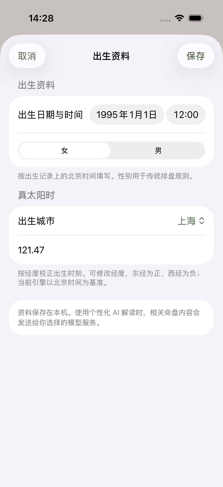
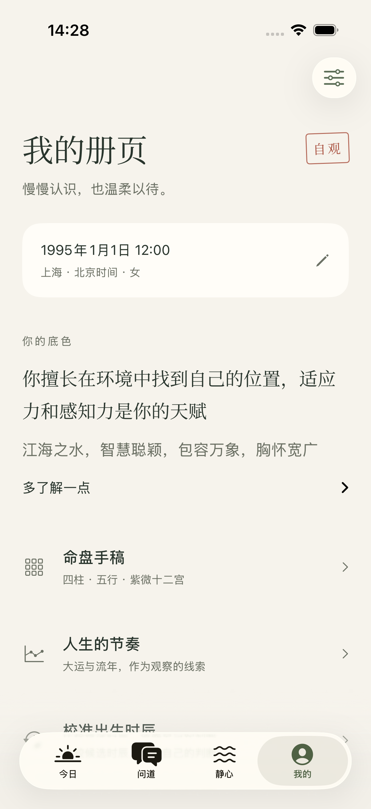
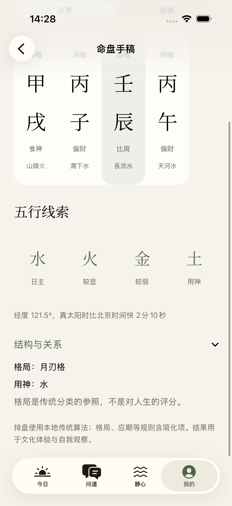
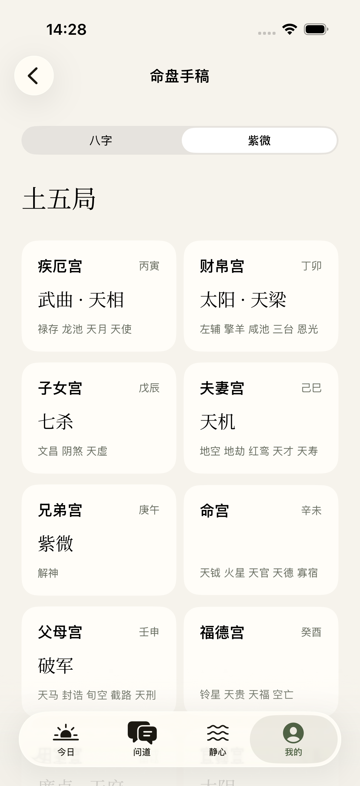
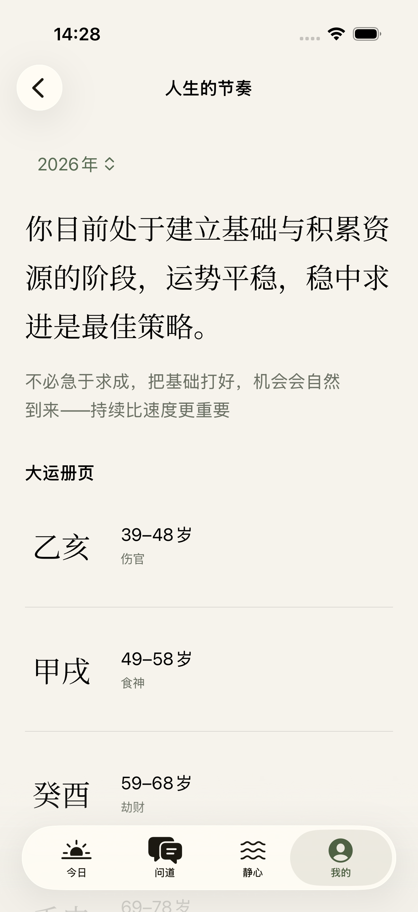
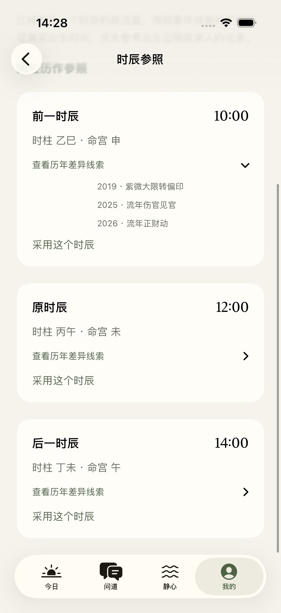
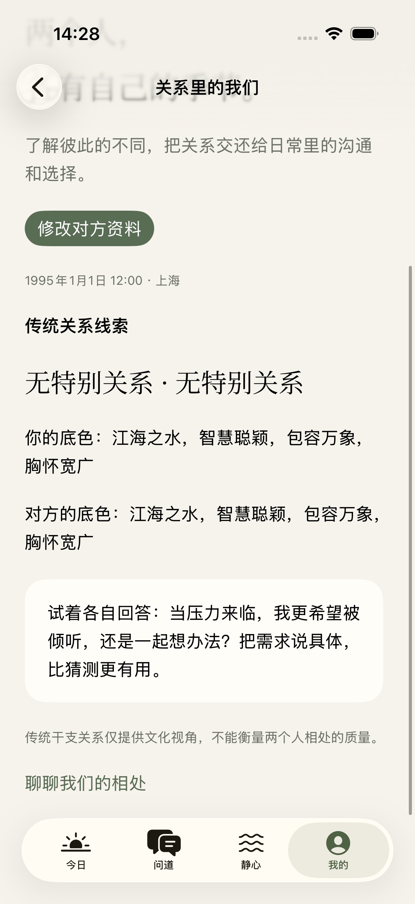
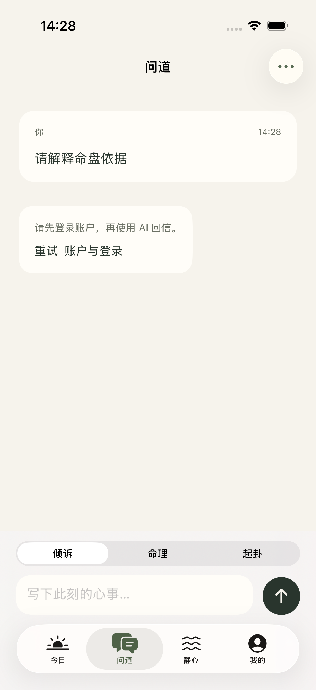
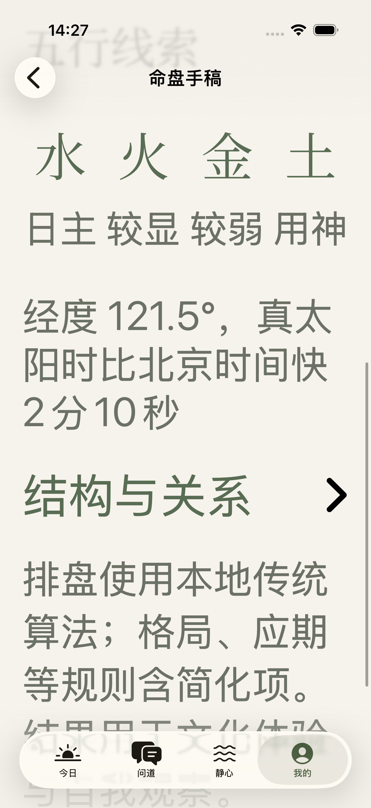

# SwiftUI 命理体验与结构：独立基线审查

审查日期：2026-09-19。基线：`df1a7c9`，仅新增捕获测试后编译。本文描述基线问题，不把随后正在开发的修复视为已验证完成。

结论：现在的 App 已有一致的视觉、顺畅的本地排盘和谨慎的校时说明，但还不能称为可复核的专业命理工具。最先要修的不是视觉，而是计算口径、同屏术语冲突、跨体系证据保留和解读的可追溯性。

## 范围与证据

- 本次实际运行 iPhone 17 Pro / iOS 26.5，中文、默认字号及 Accessibility XXXL；使用 Debug `--ui-testing` 内存册页。
- 合成出生资料：1995-01-01 12:00、女、上海、东经 121.47°。关系页双方均使用该公开的合成 fixture。没有读取真实账户、私人出生资料或密钥。
- 当前运行的 13 张原始截图已逐张打开检查；保留 9 张能支撑关键结论的图片。截图时间和测试名称见 [capture-manifest.json](../../../native/Documentation/mingli-audit/capture-manifest.json)。
- 捕获测试：[MingliAuditUITests.swift](../../../native/UITests/MingliAuditUITests.swift)。两项测试通过，71.5 秒、0 failures。结果包 `/tmp/suji-mingli-audit-20260919.xcresult`；日志 `/tmp/suji-mingli-audit-20260919.log`。
- Product Design index / audit / user-context 及审查框架已读取；preflight 没有已保存的用户设计上下文。
- 标为「截图」的结论来自本次运行；标为「源码」的结论来自基线代码，未用界面截图替代代码验证。旧 `design-qa.md` 或旧截图不作为本次证据。

## 流程逐步观察

### 1. 出生资料：可保存，口径和不确定性不足

原生表单、可取消保存、明确提示北京时间是优点。问题是已填写的经度只显示 `121.47`，可见标签消失；「真太阳时」容易让人以为两个体系都采用同一校正。没有公历标签、未知时刻/大致范围、资料来源或时刻精度。隐私说明仍写「你选择的模型服务」，与固定 DeepSeek 后端不一致。

### 2. 我的册页：可进入各流程，解释先于依据

主要入口一致、出生资料可编辑。第一屏直接断言「适应力和感知力是你的天赋」，没有同时说明这是传统映射。用户需要先读完性格结论，才能进入命盘核对；建议给出明确的「传统解读」标识和「查看排盘依据」入口，不改变现有温和的排版。

### 3. 八字盘：存在可见术语冲突

四柱和日主可读、传统简化项有说明。但同一屏上方「用神」为土，下方「用神」为水，未给口径名。源码实际分别取 `wuXingStrength.yongShen` 和 `geJuV2.yongShen`。这不能通过统一成其中一个值来修；要标注「扶抑参考」和「格局用神」，分别说明方法与局限，并解释为什么可能不同。当前没有展开藏干、通根、格局成立条件或典籍出处的路径。

### 4. 紫微盘：列表可读，专业信息被裁掉

宫名、宫干支、主星清楚。但命宫主星为空时画空白，无法区分「无主星」与加载缺失；未标身宫、四化、庙旺利陷。源码已带有 `isShenGong`、`brightness`、`sihua`，UI 仅取名字，并截断辅星为前五个，无更多入口。建议保留易读列表，给每宫可展开完整详情和空宫说明；不必强迫手机默认挤成传统十二宫方盘。

### 5. 大运流年：可达，存在需要计算验证的异常

合成资料在 2026 年的页面首段大运显示 **39–48 岁**。截图不能单独证明正确起运数值，但足以要求算法独立核验：页面也没有起运算法、参考节气、顺逆、年龄口径或首运开始时间，用户无法追查。大运列表缺公历年份和当前阶段标识，年度结论埋在大运全表之后。源码年份切换失败时保留旧 `annual`，同时年份 Picker 已变，可能把旧内容显示在新年份下；这是源码风险，本次未注入失败复现。

### 6. 时辰参照：保护措施合理，对照信息不足

明确提示不能验证真实出生时间、需要用户另行确认采用是优点。候选只有整点标签，没有完整日期、原始分钟或时段边界；零点附近的跨日候选可能不明显。展开后把「流年伤官见官」直接展示给用户，没有说明触发规则或与其他候选的差别。源码只展示最近八个年份后过滤 `none`，不保证这些年份最有区分度。更严重的是 `bridge.ts` 把八字和紫微事件按年份浅合并，紫微大限转入年会覆盖同年八字事件。应分别保留两个体系，再按年份对照，明确相同线索不提供区分能力，不能借此制造概率。

### 7. 关系解读：无伪评分，但依据不完整

没有制造兼容分数，明确不衡量相处质量，且提供实际沟通练习。当前大标题「无特别关系 · 无特别关系」没有标出分别是日干/日支；未展示比较的是哪两个干支。建议采用两个有标签的事实行与来源，然后单独放沟通建议。双方资料在该页面仅 `@State` 暂存，离开重建会丢失；如果产品不计划持久化，应明确写「本次临时比较」。

### 8. 问道：登录错误可恢复，尚未完成解读质量验证

输入被保留，错误文案准确、有账户入口。登录要求在用户发送后才出现，旁边的「重试」在未登录时无效；可在输入区预先提示登录。此次没有真实账户，未生成模型答案，所以不能从截图声称 evidence、幻觉控制、工具重试或实际回答质量已达标。下面架构检查覆盖的是这些机制的源码。

### 9. 大字号：能阅读和滚动，需进一步语义验证

字号随系统增大、页面可纵向滚动；四柱采取水平滚动以避免强行缩字。五行指标仍固定四列，标签在 XXXL 下连成一排，建议改为两列或逐项键值行。只检查了截图和 XCTest 导航，未测 VoiceOver 朗读顺序、Switch Control、对比度数值或所有机型，不能据此称为完整无障碍合规。

## 优先问题与验收要求

| 严重度 | 问题与依据 | 可实施改进 | 完成证据 |
| --- | --- | --- | --- |
| P1 | Step 3 同屏两个无标识的「用神」 | 按计算口径命名，显示各自方法、规则来源和差异说明，不强行合并 | 合成 fixture 同屏可见两个不同值和不同口径；UI 测试断言标签 |
| P1 | Step 5 首段大运 39–48，缺复核信息 | 独立核验节气/起运；显示顺逆、起运年龄、公历区间、当前阶段与未起运状态 | 外部历法或独立实现 fixture + 引擎与 UI 同值 |
| P1 | Step 1、4 两体系时刻口径未说明 | 保存公历民用北京时间和经度；展示各体系实际生效时刻、子时换日规则；明确已验证范围 | 午夜、节气边界、非 120° 经度案例在两体系说明中可追溯 |
| P1 | Step 6 校时同年事件被覆盖（源码） | `eventsBySystem` 保留八字与紫微；按年份对照且标出处，不把传统线索称为真实事件 | 同年双体系均有事件的 fixture 不丢失；UI 展示两项 |
| P2 | Step 4 有效紫微信息丢在展示层 | 每宫显示身宫、主星亮度/四化，完整辅星详情和无主星状态 | 已有 synthetic fixture 可见身宫和四化，空宫不是空白 |
| P2 | Step 6 校时推断缺证据区分 | 时间窗口/跨日日期、原资料与待采用资料差异、可撤销历史；显式允许「资料不足」 | 跨日候选正确显示日期，采用不静默丢分钟；原值可恢复 |
| P2 | Step 7 对比字段无标签 | 展示双方日柱，分别标「日干关系」「日支关系」，提示临时比较 | 同柱/合/冲等 fixture 能直接核对 |
| P2 | Step 8 登录才失败 | 登录状态在发送前可见，登录后恢复原问题 | 匿名到登录后的回归流程，不重复追加提问 |
| P2 | Step 9 四列在大字号拥挤 | 指标与紫微详情使用自适应列，数值和标签组成一个语义元素 | XXXL 截图、VoiceOver 手工检查 |
| P3 | Step 1 经纬度标签、旧模型文案 | 保留字段标签和单位；改成有时服务发送给 DeepSeek | 有值字段仍有「出生地经度」；隐私文案与实际后端一致 |

P1 = 会妨碍专业可信度或核心结果复核，应先修。P2 = 流程/信息不足或明确结构风险。P3 = 局部理解成本。本次不以总分掩盖这些差异。

## 项目结构与 harness：源码检查

现有边界的优点：SwiftUI 与引擎独立包，TypeScript 算法无需网络；JavaScriptCore 串行桥、取消状态与 account scope 检查清楚；固定工具白名单、调用上限和 receipt 持久化已经存在；工具结果而非模型文字生成 evidence，方向正确。

1. **动态 `Document` 吞掉契约错误。** `AppStore.swift:12` 的缺失字段默认变空字符串、0 或空数组。Swift 编译和页面 smoke 通过并不代表引擎响应字段仍匹配。应给出生、四柱、紫微、起运、方法元数据与校时结果建立 Codable DTO；边界校验失败必须展示「资料未能解析」，而不是一张空白但看似有效的盘。
2. **排盘结果缺版本与输入身份。** `ToolReceipt` 只有参数、输出和时间；`AppStore.updateBirth` 不改变 `scopeRevision`，过去 receipt 会继续进入 `ChatSession.historyMessages`。同一用户修改出生资料后可能混用新出生与旧命盘。应将规范化出生、计算政策、引擎/规则版本的 fingerprint 绑定 receipt，旧结果保留给历史阅读，但新问题不得当作当前依据。
3. **一次命理回答被生成两次。** `ToolOrchestrator.run` 获得 `.text` 后已经 append assistant；`ChatSession` 又加 user 指令并 `streamText` 改写。当前源码结构意味着额外调用及两次回答偏离风险，本次未测真实延迟。建议工具规划与最终回答明确一次收敛，或复用终答；评估器检查每项结论是否有 receipt 支撑，不只检查 API 成功。
4. **简短 evidence 不是完整出处链。** `evidence.ts` 默认最多六项并截断至约 18–20 字。现有 geju claim IDs、PhaseRegistry source 信息没有可点击/可展开映射到书名、版本、章节、规则状态。建议 `EvidenceRecord {id, system, ruleID, inputs, result, source, status, caveat}`，UI 展示可阅读摘要并保留全文，模型只能引用已提供 ID。不能靠添加“古籍曰”提高权威感。
5. **校时上下文缺无损类型。** `bridge.ts` 的 `events` 合并在传给 UI 和 ReflectionSession 前丢信息；`buildCandidates` 把原时刻锚定为偶数整点，原分钟消失。该选择可以用于候选计算，但必须与真实出生记录分离，采用前明确影响。
6. **ReflectionSession 与工具对话两套约束。** 校时/关系只把一段 JSON 和 prompt 交给 streaming；「最多五问」没有状态机或逐轮检查。应该有显式访谈轮数、支持/反例/未知记录和结论状态；“不知道”不能进入支持分数。
7. **验证层次要分开。** `native/Core/Tests/.../EngineTests.swift` 比较 Node 与 JSCore fixtures，是迁移一致性，不是历法正确性；算法同源时两边都错仍能通过。需要外部可核验历法样本、不同实现的差异测试、规则级传统出处、以及真实模型回答评估四层证据。不能以 UI 两项测试或 HTTP 200 覆盖这些层次。
8. **按职责拆文件即可，不必整体重写。** `ProfileView.swift` 同时包括资料表单、八字、紫微、大运；`AppStore.swift` 含持久化、引擎桥和弱类型视图数据。优先引入出生政策/排盘 DTO 与独立结果组件，再把方法说明、宫位详情和校时对照封装。避免为了目录整齐搬动已验证的算法。

## 建议的实施顺序

先固化外部历法 fixture 和计算政策，修大运/子时等基础结果；然后打通 typed metadata、receipt fingerprint 与分体系校时 evidence；最后让页面显示这些真实信息。UI 可以先落地不依赖新算法的标签修复、身宫/亮度/四化、空宫和关系字段标签。保持原有纸色、字体、导航，不做与可信度无关的重设计。

完成后按同一 synthetic fixture 复跑本次流程，另增 23:00、00:00、太阳时跨日、节气前后、时刻不确定、未知规则/失败响应、同年双体系事件及改出生资料后再次问道的验收案例。新增截图必须另存，不能覆盖本次基线证据。

## 本次不能证明的事项

未验证全球时区/历史夏令时、书籍文献规则本身、实际模型回答、登录后账户流转、实体设备、暗色所有页面、VoiceOver 或 App Store 可发布性。此次独立审查提供可复现问题和实施验收，不宣称传统命理具有预测效力，也不宣称全部引擎正确。

## 后续实现与复验（2026-09-19）

上文保留为 `df1a7c9` 的原始发现。随后按同一组模拟出生资料实现并复验，完整设计审查见 [impeccable-design-critique.md](impeccable-design-critique.md)，修后截图与各自引擎 SHA 见 [capture-manifest.json](../../../native/Documentation/mingli-improvements/capture-manifest.json)。

已落地：出生地/经度常驻标签、固定 UTC+08 与两体系时刻说明；扶抑参考/格局用神/调候文献候选分开；紫微身宫、亮度、四化、空宫说明与完整宫位详情；真实起运数值和交运日期；流年立春周期与年度参考时点；双体系校时线索及完整候选日期；双方日柱和关系字段名；XXXL 键值行；登录前说明与访谈失败重试。

初次修后实拍中，该合成资料显示逆行，出生后 8 年 3 个月 8 天 4 小时起运，首运为 2003-04-09 16:00（固定 UTC+08），替代基线的 39–48 岁首运显示。UI 实拍证明前后端数值已接通；历法正确性须结合本目录的独立样本与历法审查，不能只看这张截图。

源码另补了结果身份：流年结果按账户、完整出生资料、引擎版本、所选年份隔离；校时失败清空旧候选，采用前验证候选仍属于当前资料；关系计算返回时核对资料是否已变更。访谈 UI 读取服务派生的有效 key，旧资料只读，重试原待完成回合；打开页面后的账户/资料变化会停止并要求重新打开，避免旧上下文被标成新资料。这些防竞态路径已编译，但此次截图流程未注入跨账户异步竞态。

未知出生时刻仍没有完整产品与数据模型支持；全球时区/夏令时、真实模型访谈质量、实体设备和 VoiceOver 也仍未验收。不能把新增说明文字记作这些能力已完成。
