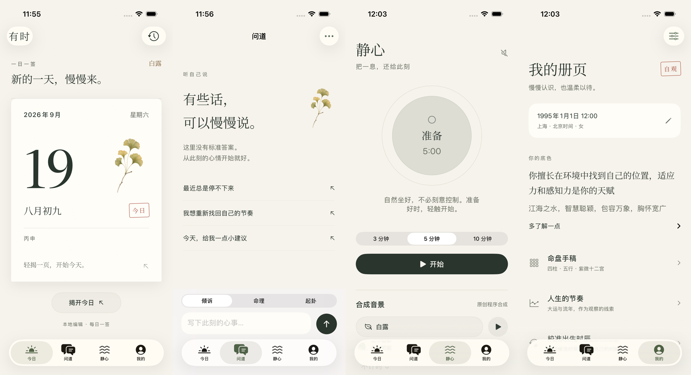

# 有时 · SwiftUI

A standalone native iPhone app for daily rituals, reflection and a quiet breathing space. All screens use SwiftUI; the existing deterministic TypeScript algorithms run locally through JavaScriptCore. No Metro, WebView, React Native runtime or server is required to launch.



## Open and run

1. Open `native/Suji.xcodeproj` with Xcode 26 or later.
2. Select the **Suji** scheme and an iPhone simulator, then Run.
3. For a physical iPhone, set your Apple development team for both **Suji** and **SujiWidget**, register their bundle identifiers and the shared group `group.app.suji.native`, then run on iOS 18 or later.

The generated project, local Swift package, engine bundle and app icon are included. Signing is deliberately enabled on the simulator because Keychain and App Group access require entitlements. Do not use `CODE_SIGNING_ALLOWED=NO` for runtime validation. The `SUJIDEV123` application identifier in `App/Simulator.entitlements` applies only to simulator builds; physical builds use Xcode's provisioning.

```sh
python3 native/scripts/generate-project.py
xcodebuild -project native/Suji.xcodeproj -scheme Suji \
  -destination 'platform=iOS Simulator,name=iPhone 17 Pro' \
  -derivedDataPath native/DerivedData build
```

## Product flows

- **Setup**: sign in/create an account, restore cloud birth data if this account has no local profile, then enter and confirm the required date/time, calculation gender and birthplace/longitude. Build a persistent natal dossier before entering the tabs. Existing signed-in users with a dossier resume directly.
- **今日**: local-calendar ritual with continuous paper curl, an accessible reveal button, saved daily quote/action, seven recorded days, a real share image, and mood notes.
- **问道**: native streamed replies, stop/retry, persistent conversation history, eight deterministic tools, expandable evidence, six-line hexagrams and the traditional spatial qimen grid.
- **静心**: 3/5/10-minute breathing sessions, pause/resume, independent rain/stream/wind/fire gains, 24 seasonal combinations, standalone playback and sleep timer. Sounds are original procedural synthesis; see `Resources/AUDIO.md`.
- **我的**: birth records, true solar time, four pillars, five elements, twelve ziwei palaces, annual/decadal content, candidate-time comparisons with explicit adoption/undo, relationship insights, journal editing and monthly reflection.
- **Settings**: warm paper, deep ink, celadon and system appearance, tone and managed AI status, account-scoped local storage, cloud profile recovery/retry, versioned archive import/export, morning and seasonal notifications, and deletion of the current notebook and cloud birth data.
- **WidgetKit**: small/medium home-screen widgets share only the current daily card. At local midnight an old snapshot becomes an invitation to open the app; yesterday's card is never labelled as today's.

AI reflection is user initiated and requires an account. The app explains when birth-derived data, messages or journal entries are sent through SUJI's authenticated backend to DeepSeek. There are no simulated AI replies. The provider key stays in Supabase Edge Function secrets; only the user's account session is stored in the iOS Keychain.

## Managed AI

Sign in at launch; manage the account via **我的 → 设置 → 账户与云端资料**. AI uses **DeepSeek Flash** (`deepseek-flash`, thinking disabled) through the existing Supabase project. There are no service URL, model or API-key fields. Chat, daily reflection, monthly reflection, calibration and relationship reflection all share this backend. Legacy provider settings in notebooks or cloud profiles cannot change the route. Deploy the function and quota migration using [the backend guide](../supabase/README.md).

## Accounts and migration

`Resources/PublicConfig.plist` is required for production account access and contains only `SUPABASE_URL` and `SUPABASE_ANON_KEY`. It is ignored by git. Set `SUPABASE_URL` and `SUPABASE_ANON_KEY` in the repository's `.env.local` (see `.env.example`), then run:

```sh
python3 native/scripts/configure-public.py
python3 native/scripts/generate-project.py
```

Existing `EXPO_PUBLIC_SUPABASE_*` names remain accepted only to migrate local configuration; new setups should use the names above. Only publishable keys or anon-role JWTs are accepted. Private model keys and Supabase service-role credentials are never copied. Configure `suji-native://auth/callback` and `suji-native://auth/reset` as allowed redirects in the existing Supabase project's auth settings before using Google OAuth or password recovery. Email/Google and the existing `profiles` table are supported. The AI backend adds a separate quota table/function; it does not change profiles.

The SwiftData notebook is stored in the app’s private container, with CloudKit disabled. Only the daily widget snapshot is written to the App Group. A prerelease shared notebook, if present, is migrated into the private store after a verified private backup; existing private rows win conflicts, and unrelated shared files are retained. Switching accounts saves the active notebook and loads an independent `local` or `user:<id>` notebook. The signed-out notebook stays preserved behind the account gate; account settings offer explicit import of its contents.

Birth edits automatically sync through the existing `profiles` table; failures retain the local birth data/dossier and a persistent upload flag. Retry from profile/account settings or when the app becomes active. A new device restores cloud birth data into an empty account. Existing local data is never silently replaced; manual cloud replacement still requires confirmation. Notebook import remains local until an explicit upload or subsequent birth edit. Cloud profiles do not contain natal snapshots, conversations, journals, rituals or AI keys.

Natal snapshots have separate `natal:user:<id>` records. Reuse requires the same owner, complete birth input, snapshot format and engine bundle digest, plus valid chart contracts and a matching payload checksum. They contain Bazi, Ziwei and fixed personality annotations; daily/annual content is computed separately. The bridge restores Date fields from JSON and never recalculates natal charts for a matched snapshot. Parallel requests share one build. Birth edits, engine updates, damaged snapshots or notebook replacement trigger rebuilding. Deletion also removes the cached chart. Archives cannot inject a trusted dossier. See [the architecture note](../docs/mingli/natal-dossier.md).

A separate app cannot automatically read the old React Native sandbox. Import accepts the native version-1 JSON archive and exported Zustand containers named `suiji-user-store` and `suiji-chat-store` (or `userStore` / `chatStore`). Old API keys and derived chart caches are discarded. If an old installation has no export facility, cloud recovery restores only the fields above. Keep an external backup before replacing a notebook.

## Verification

```sh
# Domain, native engine parity, streaming/network, archives, clocks and scheduling
TZ=America/Los_Angeles swift test --package-path native/Core
# Keychain, SwiftData account isolation, widget payload and native UI flows
xcodebuild -project native/Suji.xcodeproj -scheme Suji \
  -destination 'platform=iOS Simulator,name=iPhone 17 Pro' test
# Public app configuration and credential separation
python3 -m unittest discover -s native/scripts/tests -v
# Deterministic engine (independent of any client framework)
npm ci --prefix native/Engine
npm run typecheck --prefix native/Engine
npm test --prefix native/Engine
```

As of 2026-09-24, the current product scope defers large Dynamic Type adaptation and removes its dedicated test variants. Normal-size functional assertions, dark mode, account isolation and evidence validation remain in scope. Historical large-type failures remain documented; deferral is not a fix.

UI tests use an in-memory notebook via a Debug-only test launch argument and attach actual simulator screenshots. They do not overwrite a user's persistent notebook. The test run contains no live AI/auth requests with user credentials. See `VERIFICATION.md` for executed results and remaining physical-device/online checks.

To regenerate the deterministic engine and independent Node fixtures:

```sh
npm ci --prefix native/Engine
npm run build --prefix native/Engine
```

All algorithm sources, dependencies and tests are contained in [Engine](Engine/README.md). The retired Expo build is available in Git at `328bcff`.

Fixtures compare the current Node algorithms running in Beijing time with JavaScriptCore under a different host timezone, including midnight, night-zi, leap-day, longitude and solar-term boundaries. Equality is evidence of migration parity, not validation of traditional claims.

## Method boundaries

Birth calculations currently require civil Beijing time (`Asia/Shanghai`) with explicit longitude. Historical daylight-saving and worldwide timezone conversion are not validated. The 23:00–23:59 calibration path is explicitly unavailable because the old candidate engine does not support it. Qimen uses a documented fixed 坤二寄宫 school and source-audited structural conditions; it is not a complete traditional auspicious-date solver. Pattern strength thresholds remain engineering heuristics, and their sensitivity and source limitations are recorded. Relationship views show interpretable stem/branch relationships instead of an unsupported compatibility score. The existing algorithms contain distinct traditional interpretations; forecasts are cultural reflection, not medical, financial or life-decision advice.

The app is not an App Store release. Real device haptics, prolonged audio quality/background behavior and full account delivery still require final release testing. Paid subscriptions and gift-commerce were deliberately excluded from this approved rebuild.

## Visual direction

The final native interface follows the user's [Figma moodboard](https://www.figma.com/design/Nk1dbVHGGPwvg0JwjxS5v6/Untitled?node-id=1-17): cream paper, olive ink, botanical detail and editorial whitespace. It keeps native TabView, NavigationStack, segmented controls, sheets and forms. The original ginkgo illustration was generated with Azure GPT Image 2; asset provenance and prompt are documented in `Resources/ARTWORK.md`.

The paper ritual bends continuously with the user's drag, returns below the threshold, and completes with restrained feedback. [Actual simulator motion](Documentation/ritual-drag.mp4) is included. Reduce Motion keeps an equivalent reveal operation. The design comparison and accessibility evidence are in `design-qa.md`.

## Typography

Chinese editorial text uses bundled **Noto Serif SC**, Copyright 2012 Google Inc., under SIL Open Font License 1.1. The font is distributed with its license at `Resources/Fonts/OFL.txt`; it is loaded offline and respects Dynamic Type. Source: [Google Fonts / Noto Serif SC](https://github.com/google/fonts/tree/main/ofl/notoserifsc). Body text and controls use the system font.
